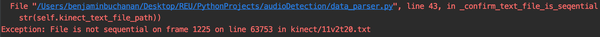
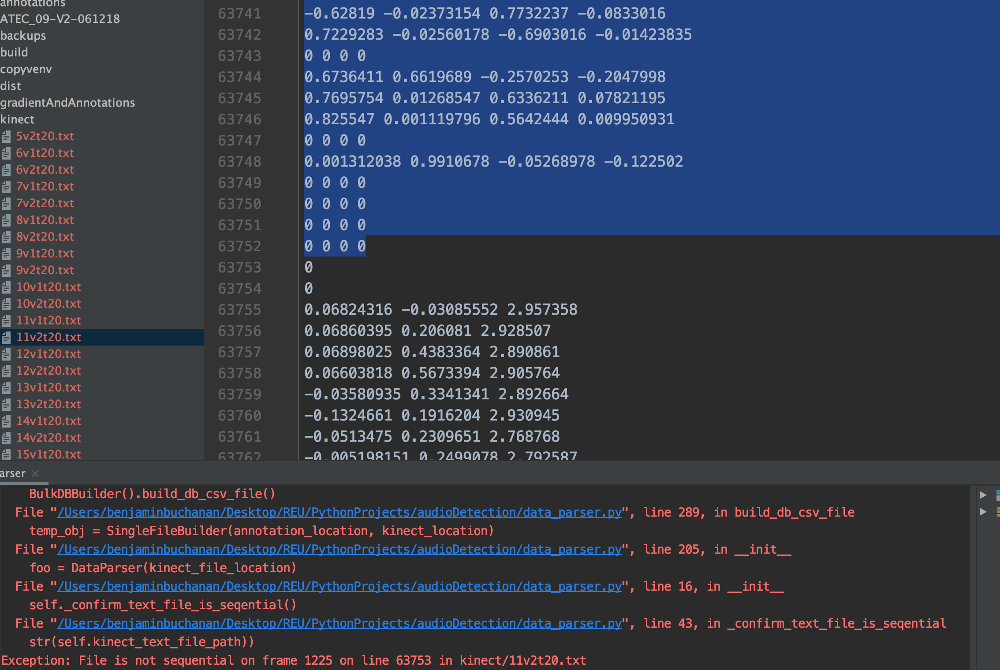
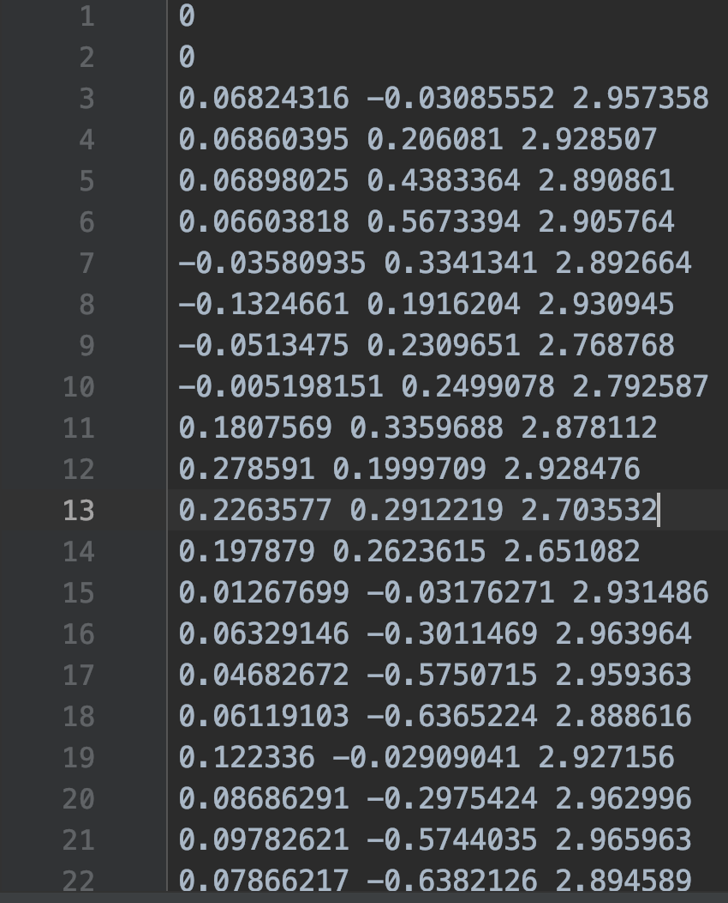

# ATEC_Sailor_Step_DB_Builder
A short Python file that creates a csv file for Machine Learning training for the ATEC project run by Dr. Bell at Yale Univeristy. This program parses raw Microsoft Kinect data and return the gradient for the left and right foot for 45 frames at a certain timestamps. 

To ensure the program runs as intended:
1. All of the annotations should be placed in a folder called 'annotations'
2. Everything in that folder needs to have the following file naming convention

   - Example: ATEC_05-V1-052418_task20.txt.txt
   - 05 is the subject number
   - V1 is the visit number, this will only be V1 or V2
   - task_20 or task_21
3. All of the kinect files need to be placed in a folder called 'kinect'

   - Example: 5v2t20.txt
   - 5v2 is the subject and visit number
   - 20 is the task number
   - The 't' needs to be there to seperate the subject/visit info from the task number
   
To create the database simply run data_parser.py
             

If an exception is thrown where the file is not sequential, the following steps should be taken:
  1. The exception will specify the line number where the kinect data repeats. 
  
  2. Open the text file mentioned in the exception and delete everything above this line number
  
  3. Ensure that the first two lines of the program are 0 and 0 after the deletion
  
  4. Repeat these steps everytime this kind of exception is thrown 
